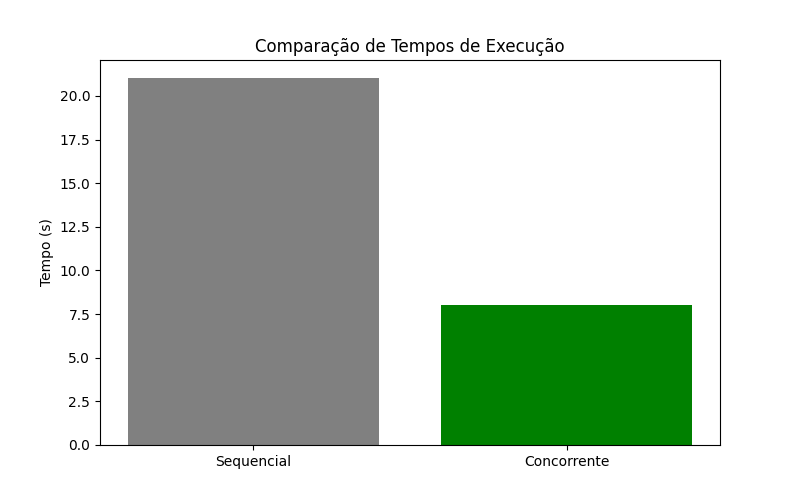

# Central de Atendimento Multithread

Este projeto é uma simulação de uma central de atendimento onde **técnicos (threads)** atendem chamados de forma concorrente, utilizando **Python** e **fila sincronizada (`queue.Queue`)** para controle de tarefas.

---

## 💡 Objetivo

Demonstrar o uso de **multithreading** em Python em um ambiente simulado de atendimento técnico, com:

- Processamento simultâneo de chamados
- Fila segura entre threads
- Geração de logs individuais para cada técnico
- Comparação entre atendimento sequencial e concorrente
- Geração de gráfico de desempenho

---

## 📁 Estrutura do Projeto

```
├── central_atendimento.py       # Código principal
├── .env                         # Variáveis de ambiente (opcional)
├── .gitignore                   # Ignora ambiente virtual, logs e arquivos gerados
├── requirements.txt             # Dependências do projeto
├── grafico_comparativo.png      # Gráfico gerado automaticamente
└── logs/                        # Subpasta gerada automaticamente com os logs
    ├── tecnico_1/
    │   └── log_DD-MM-YYYY.txt
    ├── tecnico_2/
    └── tecnico_3/
```

---

## ▶️ Como Executar

### 1. Clone o repositório e entre na pasta

```bash
git clone <URL-do-seu-repositório>
cd central-de-atendimento
```

### 2. Crie e ative o ambiente virtual

```bash
# Windows
python -m venv .venv
.venv\Scripts\activate

# Linux/macOS
python3 -m venv .venv
source .venv/bin/activate
```

### 3. Instale as dependências

```bash
pip install -r requirements.txt
```

> Se ainda não existir, você pode criar o arquivo `requirements.txt` com:
> `pip freeze > requirements.txt`

---

## ⚙️ Arquivo `.env` (opcional)

Você pode configurar variáveis como número de técnicos/clientes no arquivo `.env`:

```env
NUM_TECNICOS=3
NUM_CLIENTES=10
```

---

## 🧪 Comparação de Desempenho

O script executa **modo sequencial** e **modo concorrente** automaticamente, medindo o tempo de execução de ambos e gerando um gráfico.

### 🔽 Exemplo de saída:

```
Executando comparações de desempenho...

Tempo sequencial: 20.13s
Tempo concorrente: 6.25s

Gráfico gerado: grafico_comparativo.png
```

### 📊 Gráfico gerado:



---

## 📌 Tecnologias utilizadas

- Python 3
- `threading`, `queue`
- `matplotlib` para gráficos
- `os`, `datetime`, `random`
- `.env` com `python-dotenv` (opcional)

---

## ✍️ Autores

- João Pedro Labussiere  
- Leonardo Vasconcellos  
- Marcell Dactes Andrade  
- Pedro Vinícius Mota  

Desenvolvido como parte da disciplina **Programação em plataformas de alto desempenho**.

---